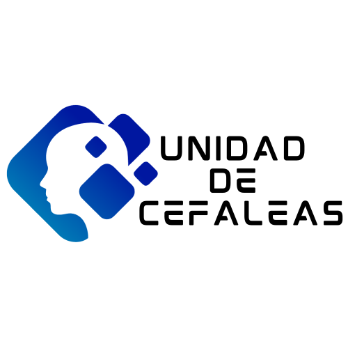

# Unidad de Cefaleas - Hospital Universitario La Paz

¡Bienvenido a la página web de la Unidad!

---

## [Nuestro Equipo](./nuestro-equipo.html)

  <!-- COLUMNA IZQUIERDA -->
  

    

      <strong>Dr. Javier Díaz de Terán</strong> 
      Coordinador de la Unidad de Cefaleas
      
    

    

      <strong>Lucía Zaballa</strong> 
      Neuróloga
    

  

  <!-- COLUMNA DERECHA -->
  

    

      <strong>Leonardo Portocarrero Sánchez</strong> 
      Neurólogo
    

    

      <strong>Maria José Ruiz Castrillo</strong> 
      Enfermera Especializada
    

  

---

## Información y Recursos

  *   [Información para Pacientes](./informacion-paciente.html)
  *   [Información para Médicos](./informacion-medicos.html)
  *   [Nuestra Actividad y Publicaciones](./publicaciones.html)
a
